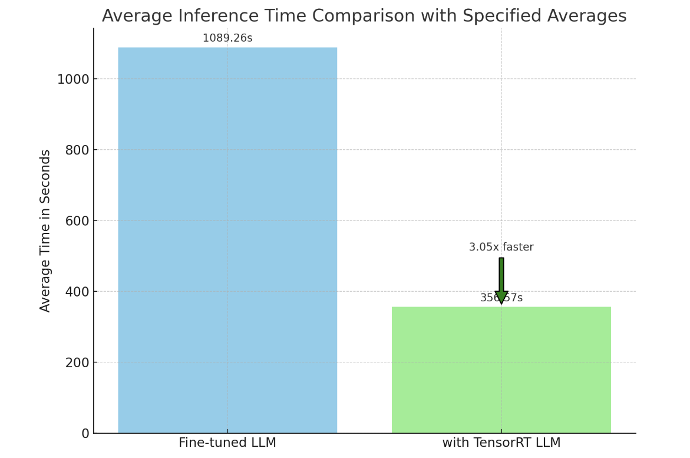
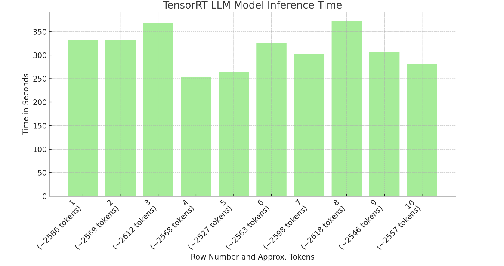
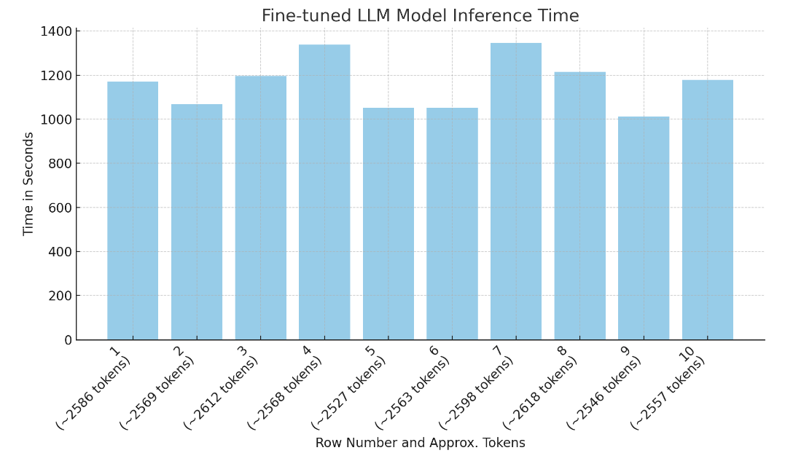
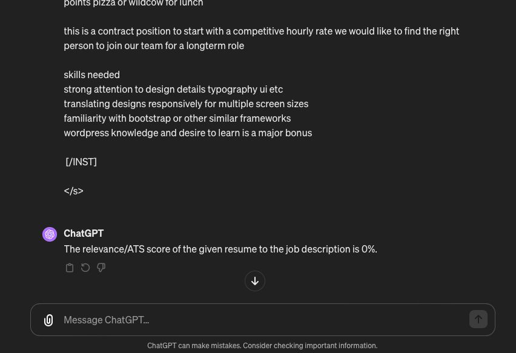
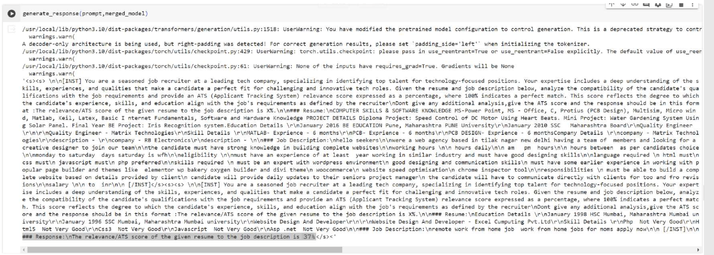

# Resume Tailoring Chatbot: LLM with NVIDIA TensorRT Optimization

## Introduction

Welcome to the GitHub repository for a cutting-edge chatbot that specializes in tailoring resumes to job descriptions. This chatbot is powered by a fine-tuned Large Language Model (LLM) capable of providing precise Applicant Tracking System (ATS) scores, guiding users in optimizing their resumes for various job applications. A highlight of this project is the enhanced performance through NVIDIA TensorRT optimization on RTX PCs.

## Model Architecture and Fine-Tuning

This model is built upon `mistralai/Mistral-7B-Instruct-v0.2`, using `BitsAndBytesConfig` for efficient 4-bit quantization, optimized for NVIDIA's advanced hardware. The model undergoes further refinement with `AutoPeftModelForCausalLM` configured via `LoraConfig` to prepare for `kbit` training. The fine-tuning leverages the `SFTTrainer` class from the `trl` library, with a max sequence length of 2048 tokens.

## Training Process

`TrainingArguments` set the stage for training, specifying epochs, batch size, learning rate, and evaluation strategy. We used a custom dataset using that has accurate ats scores for resumes based on the given job descriptions. The training process follows these defined parameters, ensuring the model's adeptness at generating ATS scores.

## Enhanced Resume Tailoring with Fine-tuned LLM
In the landscape of job-seeking tools, Large Language Models (LLMs) have become a beacon of hope for candidates looking to polish their resumes. However, the standard LLMs currently available often miss the mark, providing ATS (Applicant Tracking System) scores that are hit-or-miss, with a success rate not exceeding 50%. The uncertainty these models introduce into the resume tailoring process undermines their utility, leaving users without the concrete guidance they need.

My project introduces a paradigm shift in this arena by presenting a fine-tuned LLM that not only elevates the accuracy of ATS scores but also ensures the generation of a score with every query — a success rate of 100%. This leap in performance stems from specialized fine-tuning processes that hone the model's focus on resume evaluation.

## Project Highlights
The LLM at the heart of this chatbot has undergone an extensive fine-tuning process, employing cutting-edge techniques such as 4-bit quantization and LoRA-based adaptations, which are perfectly complemented by NVIDIA's TensorRT optimizations on RTX PCs. This synergy between hardware acceleration and software expertise results in a model that can swiftly and accurately generate ATS scores, providing users with precise and actionable feedback on their resumes.

Moreover, the project stands out by not only providing this high level of accuracy but also by significantly improving inference times. It showcases how the integration of TensorRT can expedite LLM operations, thus enhancing the user experience through increased responsiveness.

## Conclusion
In conclusion, this project represents a significant advancement in the application of LLMs to the job application process. It brings to the table a tool that guarantees ATS score generation with unmatched precision, backed by the robust performance enhancements afforded by NVIDIA's RTX PCs. This LLM chatbot is not just an incremental improvement but a pivotal innovation that could redefine how job seekers approach resume tailoring.

## How to Use

Post-training, the model is a bona fide expert at evaluating and enhancing resumes. It is available on Hugging Face at: [mistral_ATSscore_generation](https://huggingface.co/SlyGoblin/mistral_ATSscore_generation).

This model stands out by providing ATS scores with unparalleled accuracy.

## Performance Insights

Included in this repository are benchmarks demonstrating the inference time improvements using NVIDIA TensorRT optimization compared to standard configurations.

- 
- 
- 

## Some results
# Input:
`Resume:
         RECRUITING AND HR MANAGER       Summary     Experienced Corporate Recruiter who is self-motivated, results driven, highly responsive and able to prioritize effectively to accomplish multiple tasks and stay calm under pressure.  Offering over 6 years of recruiting, human resources and staffing experience with a Bachelor's Degree in Human Resources Management.  Experience with full life-cycle recruiting of qualified IT professionals including college graduates, experienced software developers, business/technical consultants, sales executives, project managers, and executive level staff.       Highlights          Excellent interpersonal, communications and negotiation skills  Pro-active and creative sourcing strategies  Full life-cycle recruiting  Infor Talent Management  Thrive in a fast paced environment  Knowledge of EEO/AA regulations  Experience with online recruiting sources  College recruiting      Extremely adept working with multiple hiring managers  Comfortable handling high requisition load  On-boarding  New hire orientation  HR management   ADP Workforce Now  Benefits Administration   Strong MS Office skills including Word, Excel, PowerPoint and Outlook             Experience      Recruiting and HR Manager   06/2015   to   Current     Company Name   City  ,   State      ENAVATE provides business consulting and industry-focused enterprise software solutions based on the Microsoft Dynamics AX and CRM platforms, with a full range of services including professional services, maintenance and support. Through its wholly owned subsidiary, Celenia Global Services, the company also provides consulting and software development services to Microsoft Dynamics enterprise clients, ISVs and VARs worldwide.      Recruitment & Onboarding    Responsible for managing and leading the recruitment process to meet the various staffing goals across all levels of the ENAVATE and Celenia North America organization (Development, Delivery/Consulting, Sales/Marketing, Operations, Program Management, Managed Services, and Shared Services departments)  Develop recruitment strategies to achieve
    required staffing levels  Manage all recruiting activities for open
    positions to include sourcing, screening, interviewing, selecting and hiring
    candidates  Create, streamline, improve and update
    recruiting process, procedures, forms and tools  Maintain partnerships with hiring managers to
    determine characteristics, criteria, and needs of open/new positions  Ensures there is an understanding of the
    job presented in reference to its requirements and the type of candidate sought  Work with hiring managers and appropriate
    Business Unit leaders to develop specific recruiting plans for each open
    position  Meet with leaders on weekly basis, if needed,
    to give updates and review applicant tracking spreadsheet     Execute sourcing strategies resulting in
    obtaining qualified candidates, including developing job posting content,
    posting jobs internally and externally, perform online searches and utilize
    online resources  Create and update job descriptions as needed
    in cooperation with hiring managers  Maintain and continue to develop and improve
    the company career page  Review resumes and qualifications for
    appropriateness of skills, experience, and knowledge in relation to position
    requirements  Prescreen candidates through resume/application
    and phone screen process.    Compile and
    present prescreening information and feedback to hiring managers and
    collaborate in decision to move forward with selected candidates  Coordinate with candidates and hiring
    managers to schedule phone and onsite interviews  Provide accurate and inspiring information to
    candidates about the company and position  Support hiring managers through the interview
    process, including use of interview guides and forms and coaching on interview
    techniques and behavioral-based interviewing methodologies  Develop and conduct training programs for
    hiring managers and staff designed to improve recruiting and hiring efficiencies  Direct the efforts of employment agencies and
    search firms including negotiating and controlling employment related fees  Develop and maintain professional
    relationships with college, university and community college placement offices
    as a source to generate qualified applicants  Manage and coordinate all communication with
    passive and active candidates  Participate in development of annual
    recruiting budget  Perform reference and background checks on
    selected candidates and review results with hiring managers  Coordinate and help to present offers of
    employment to selected candidates.    Coach
    hiring managers on process of extending verbal offers and negotiations  Oversee the onboarding process for all new
    hires within the ENAVATE and Celenia North America locations to include
    coordinating all new hire training sessions with appropriate BU leaders and ensure
    all onboarding steps are completed   Identify gaps in the hiring process and
    continuously work with others to improve processes, introduce new methodologies
    and measure progress
          Human Resources    Create and participate in new hire
    orientations  Ensure all current and new employees are
    provided with information about company policies (employee handbook), job
    duties, working conditions, wages, opportunities for promotion and employee
    benefits  Administer the benefits package covering
    medical, dental, vision, COBRA, FSA/HSA and basic/voluntary life insurance and
    comprehensive 401(k) plan for all North America employees   Devise timeline for payment of all benefit premiums; coordinate payment of 401(k) remittance with Accounting department  Assist in analyzing and modifying
    compensation and benefits policies to establish competitive programs and ensure
    compliance with legal requirements  Manage and keep track of PTO for all NA
    employees  Handle termination processes including the setup/removal of benefits; conduct exit interviews as part of the company's employee exit plan   Oversee and administer the payroll process
    for North America ensuring that payroll is submitted successfully, accurately
    and in a timely manner  Foster an environment of good employee
    relations and customer service throughout the organization  Perform quality work within deadlines with or
    without direct supervision  Interact professionally with other employees and
    customers
      Work independently
    while understanding the necessity for communicating and coordinating work
    efforts with other employees and organizations          Talent Acquisition Specialist   11/2014   to   05/2015     Company Name   City  ,   State       Responsible for the recruitment of Shift Supervisors, Assistant General Managers, General Managers, Area Managers, and Regional Operation Managers across over 450 locations throughout the U.S. (carried a requisition load of over 200 openings nationwide)  In charge of sourcing talent through CareerBuilder, LinkedIn Recruiter, Indeed, and Snagajob  Execute legally complaint job postings to all internet sites, perform refreshes and removal as required  Review applications and resumes and determine if they are a potential fulfillment of a position  Conduct phone screens, interviews, background and reference checks  Provide feedback on candidates to hiring managers, agencies and/or directly to candidates  Generate offer letters and communicate with hiring/area managers at multiple locations and executive level staff on recruiting efforts and strategy  Responsible for evaluating and implementing all recruiting best practices and strategies in conjunction with leadership team  Provide "virtual" support and direction for field restaurant management team  Train restaurant managers and multi-unit managers on effective recruiting strategies  Keep track of candidates through Infor Talent Management online Applicant Tracking System and CareerBuilder TalentNetwork  Help to develop new recruitment initiatives to satisfy the needs and demands of the business and increase recruiting effectiveness          Manager of Employee Recruitment & Development/Recruitment Specialist   05/1999   to   10/1999     Company Name   City  ,   State      The John Constanza Institute of Technology provides education, software, and consulting services to leading manufacturing corporations worldwide and considered the leader in Demand Flow Technology.    Responsible for the recruitment of experienced software developers, software testers, sales managers, senior manufacturing consultants, and executive level staff.  Lead consultants through the full recruiting lifecycle - conducted phone screens, on-site interviews, extended employment offers, and negotiated salary when necessary.  Conducted recruiting searches via internet, employment ads, career fairs, and administered the employee referral program.  Handled all employee issues for the Denver office (90+ employees).  Conducted exit interviews and kept track of performance evaluations and status changes.  Prepared monthly ER&D reports for the Executive Board which included current employee headcount, EEOC statistics, recruiting activity, staffing report, new hires, terminations, source trends, budget vs. actuals.  Managed the ER&D department which included supervising the HR Generalist and Benefits Administrator.          Regional HR Manager/Recruiter   01/1998   to   01/1999     Company Name   City  ,   State      Provides business and technical consulting, custom software application development, and systems integration solutions for clients in the Energy & Utilities, Communications and Financial markets.    Acted as Regional HR Manager for the Denver office (75 employees) which included: conduct all new hire orientations and exit interviews, handle all employee issues and HR administration, coordinate and participate in new hire training, benefits coordination, training and leave administration, and visa processing at the local/regional level, input data and any changes into the HRIS system.  Participated in weekly management staffing meetings and drove the staffing initiative for the Denver office (created and managed staffing pipeline report, matched opportunities and staff on upcoming projects and supported communication between managers).  Responsible for the recruitment of experienced software developers, technical/business consultants, project managers and IT professionals for the Denver office.  Represent LCG at professional career fairs, place employment ads, conduct internet job searches, and handle all employee referrals.  Lead candidates through the recruiting lifecycle - conduct initial phone screens, closing interviews, extend offers to all full-time, part-time, admin, temp, and contract to hire employees for the Denver office.  Establish relationships with contracting agencies and act as primary contact for the Denver office.  Advise managers on employee policies and guidelines.          Corporate Recruiter/Staffing   05/1995   to   11/1998     Company Name   City  ,   State      International business and information technology consulting firm specializing in business re-engineering, custom software development, change management, systems integration and implementation.    Responsible for the recruitment of technical and functional IT professionals from college and open market.  Represented AMS at professional job fairs, college campuses and special recruiting events.  Reviewed thousands of college resumes to determine pre-selects for campus interviewing schedules.  Created training curriculum and materials for our college brown bag interview presentations.  Traveled to over 10 different colleges and universities to conduct campus interviews and participate in campus presentations.  Facilitated weekly resolution meetings with interviewers and managers to make hiring decisions.  Traveled extensively to Redwood City, CA to lead the college recruiting efforts of this new Telecom college hire location.  Worked as part of the Denver-based recruiting team as a recruiter in all aspects of the hiring process.  Acted as Staffing Coordinator for the Telecommunications Industry Group which included: informing the staff of available assignments and helping them to understand the staffing process, ensured that the professional staff was being challenged and leveraged optimally, attended weekly staffing meetings with department managers to discuss available staff and business needs, created and maintained ongoing staffing pipeline report.          Human Resources Coordinator   06/1994   to   05/1995     Company Name   City  ,   State       Coordinated the recruiting process, set-up interviews, screened candidates, and extended job offers.  Conducted new hire orientations, handled employee inquiries regarding health, dental, 401k, HR issues, and company policies.  Assisted with employee spending accounts and benefits administration, input employee information into automated HRIS database.  Developed and administered service award program for employee appreciation.  Planned and coordinated company sponsored programs such as the Annual Blood Drive, Health Fair and Employee Store.          Education      Bachelor of Science  :   Management of Human Resources   1997       Colorado Christian University   City  ,   State  ,   US             License  :   Colorado Real Estate Brokers    Armbrust Real Estate Institute   City  ,   State  ,   US             Skills     Recruiting, Staffing, Training, College Recruiting, Sourcing, Phone screens, Interviewing, Negotiation, Recruiting Events, New Hires, On-boarding, HRIS/ATS, HR Administration, Employee Issues, Terminations, Recruiting Best Practices, Performance Evaluations, EEO, Human Resources Management, Ms Office Suite Job Description: designups is a nashville based design and interactive agency at designups we have a strong focus on elevating brands with our expertise in design and customer experienceare you a frontend developer with a serious interest in design and ui this could be a great fit if so this job is for someone in the greater nashville area the majority of the work can be done remotely but we do require some time in our east nashville office location hey its not too bad to walk to five points pizza or wildcow for lunch this is a contract position to start with a competitive hourly rate we would like to find the right person to join our team for a longterm role
skills needed
strong attention to design details typography ui etc
translating designs responsively for multiple screen sizes
familiarity with bootstrap or other similar frameworks
wordpress knowledge and desire to learn is a major bonus
`
## Output
Gpt4 Gives output says 0% while the finetuned model gave a percentage of 37%
- 
- 
  

